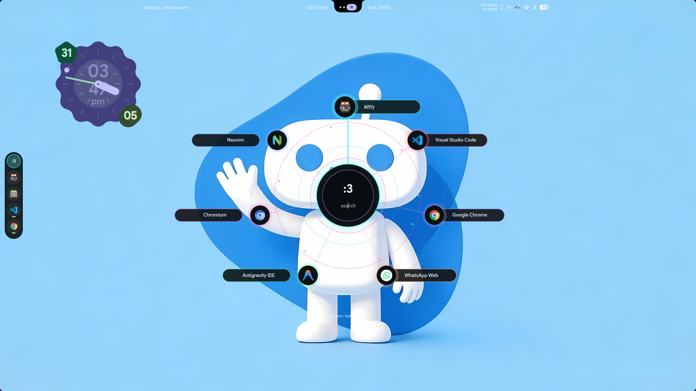
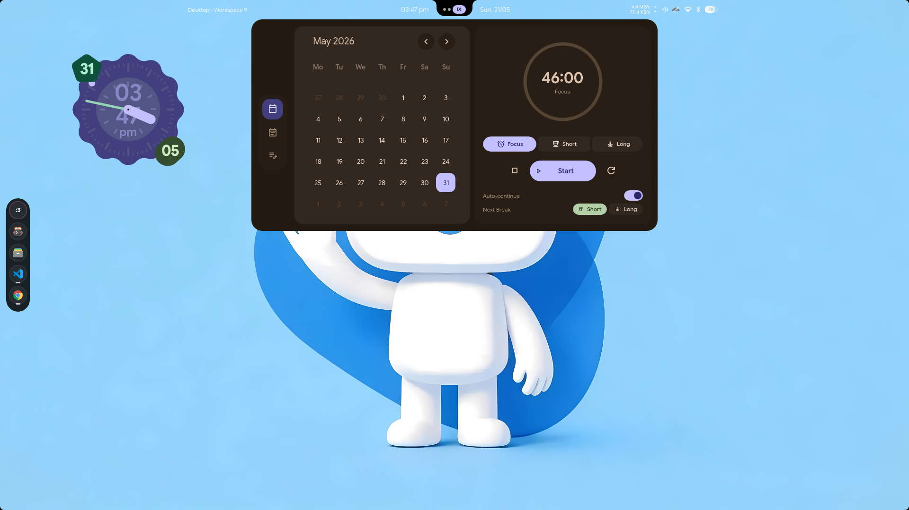

# Asura Quickshell

Personal Quickshell desktop shell for Hyprland.

This is the standalone public backup of the `nandoroid` shell from my CachyOS/Hyprland setup. It includes the shell UI, services, widgets, scripts, Material-style theming, launcher, dashboard, dock, quick settings, wallpaper tools, notifications, and system monitor panels.

## Status

This repository is highly experimental and unstable. Large parts of the current config were generated or heavily modified with Codex 5.5 while tuning a live desktop, so some features may be incomplete, machine-specific, or broken outside my setup.

Use it as a reference or backup, not as a polished drop-in shell.

## Credits

Thanks to [na-ive](https://github.com/na-ive) for making Nandoroid, which this setup is based on.

## Screenshots






## Install Path

Clone or copy this repository to:

```bash
~/.config/quickshell/nandoroid
```

Start it with:

```bash
quickshell -c nandoroid
```

Restart after changes:

```bash
~/.config/quickshell/nandoroid/scripts/restartshell.sh
```

## Main Keybinds

These are wired from my Hyprland config:

- `Super + A` or `Super + Space`: launcher
- `Super + D`: dashboard
- `Super + N`: quick settings
- `Super + G`: quick actions
- `Super + I`: settings
- `Super + W`: system monitor
- `Super + V`: clipboard history

## Notes

- Runtime usage history is intentionally excluded from the repo.
- This shell expects Hyprland, Quickshell, PipeWire, NetworkManager, BlueZ, and common desktop portals.
- Some paths, scripts, app names, and Hyprland IPC calls are tailored for my user/session.
- The full system restore scripts and package manifests live in `asura-system-config`.
